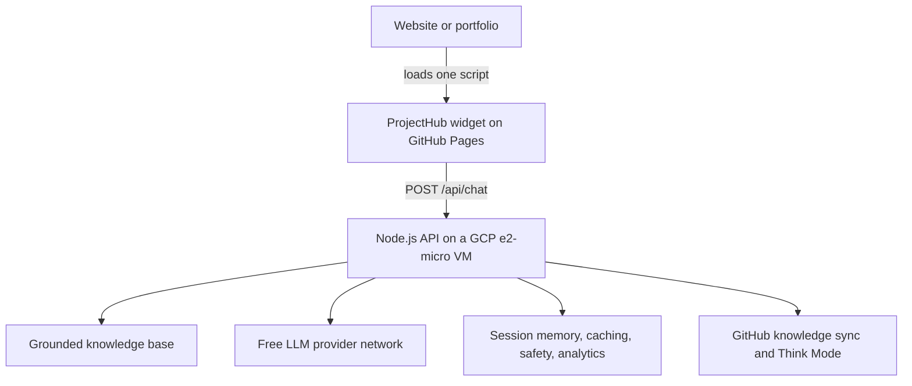
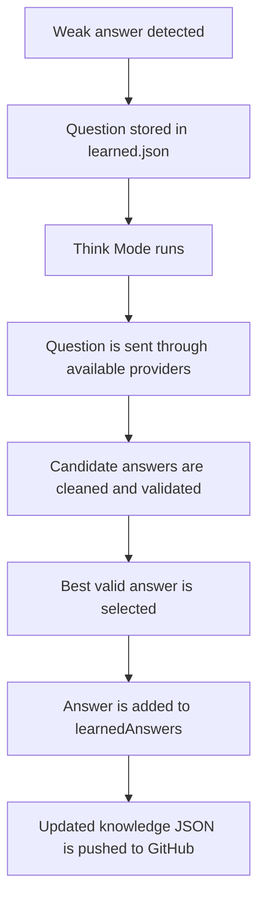
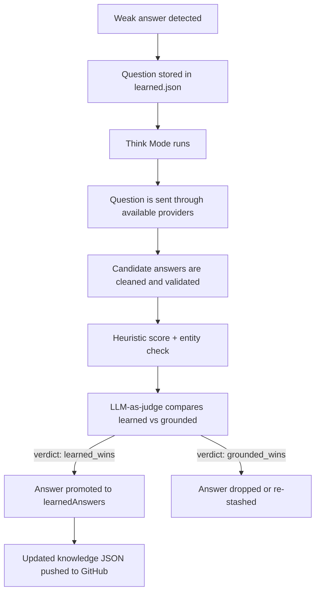

I built a chat widget for my portfolio. One script tag, drop it on a page, and recruiters can ask questions about my projects, my AWS internship, what I actually know, and what kind of roles I'm looking for. I named the assistant Scout.

```html
<script src="https://bradleymatera.github.io/ProjectHub/ProjectHub.js"></script>
```

That's the whole pitch from the outside. What it took to get there is a lot messier than one script tag suggests. The current version has a vanilla JS frontend, a Node backend on a Google Cloud e2-micro VM, a knowledge base pulled from GitHub, a network of free LLM providers, a response cache, per-tab memory, safety checks, a self-improvement loop, and an analytics dashboard. It also has six test suites and more documentation than I expected.

The one rule I kept coming back to: it had to stay useful without me paying for AI traffic.

## Why I built this in the first place

My portfolio is scattered. Projects live on GitHub, demos live on various subdomains, blog posts are on the site, certifications are listed somewhere ([AWS AI Practitioner badge](https://www.credly.com/badges/fcbb3120-f086-4784-9cb5-80daca9fb61a/linked_in_profile), [AWS Solutions Architect badge](https://www.credly.com/badges/fe12a8a4-dacf-43cb-bfe1-c8c75e20585f/linked_in_profile)), and my actual AWS internship experience is explained in a few different places. A motivated recruiter could piece it all together, but most recruiters are not motivated. They are busy.

I realized I was asking them to do homework. That seemed backwards. So I thought, what if they could just ask?

Scout is supposed to answer straight questions like "What is Bradley's strongest project?" or "Does he actually have production AWS experience?" or "What does he want to be paid?" It doesn't pretend to be me, doesn't inflate my title, and doesn't try to sell me as a senior engineer when I'm not one. It just answers from verified stuff.

## The architecture

Three layers. Site loads one script. The script hits the backend. The backend either answers from the knowledge base or falls through to free LLM providers.



Frontend is GitHub Pages. Backend is a tiny GCP VM. Knowledge is a JSON file in the repo. The important part is that if every AI provider fails, Scout still has a real answer from the knowledge base. The fallback isn't a sorry message. It actually works.

## Why vanilla JavaScript

I didn't want to force anyone to install a React component or deal with npm just to embed a chat widget. Some portfolio sites are just static HTML. Some are WordPress. Some are whatever the person already has. If the widget needs a build step, most people won't use it.

So the whole widget is vanilla JS. I split it into `data.js`, `utils.js`, `logic.js`, and `ui.js` for my own sanity, then concatenate them into one `ProjectHub.js` file for deployment:

```bash
cat data.js utils.js logic.js ui.js > ProjectHub.js
```

`data.js` holds project and CodePen data. `utils.js` has GitHub API helpers. `logic.js` does intent detection. `ui.js` draws the chat box. The modules use IIFEs and globals so the concatenated file runs straight in a browser without any build tooling. It feels old school, but it works everywhere.

## How the frontend handles sessions

Each tab gets its own session ID. The widget keeps around ten recent turns in memory and sends the last five to the server. Scout asks for the visitor's name once per tab and stores it in `sessionStorage`. I didn't want permanent identity tracking. This is a recruiter assistant, not a surveillance tool.

When someone hits Clear Memory, the transcript, session ID, name, and local context all reset. The backend doesn't keep a database of conversations either. Memory lives in process and can disappear on restart. That is fine for this use case, and it keeps the VM small.

## Mobile UX

On desktop the suggestion chips sit in a horizontal row that scrolls. On mobile they originally wrapped vertically and ended up covering most of the chat window. I fixed that by making them horizontally scrollable on all screen sizes, showing only the first six chips on narrow screens, and adding a Hide/Show suggestions toggle. The result is a chat interface that stays readable on a phone without losing the starter questions.

## The backend

The production server is in a file called `server-gemini.js`. The name is misleading. It is a leftover from when the backend only used Gemini. Now it supports Groq, Cloudflare Workers AI, GitHub Models, Google Gemini, xAI Grok, and an optional OpenAI-compatible endpoint. The main endpoints are `/`, `/health`, `/api/knowledge-health`, `/api/chat`, and `/api/think`.

A chat request looks like this:

```json
{
  "message": "What AWS experience does Bradley have?",
  "sessionId": "ph_example_session",
  "history": [
    {
      "user": "Who is Bradley?",
      "assistant": "Bradley is a web developer..."
    }
  ]
}
```

And the response carries more than just the reply text:

```json
{
  "reply": "Bradley completed an AWS Cloud Support Associate internship...",
  "provider": "grounded",
  "model": "knowledge-json",
  "grounded": true,
  "fallback": false,
  "cached": false,
  "pipeline": [
    "cache-miss",
    "knowledge-loaded",
    "learned-check:miss",
    "mustStayGrounded:true",
    "shaped"
  ],
  "followUps": [
    "What about his AWS certifications?",
    "Did he work with production systems?"
  ]
}
```

The `pipeline` field is the part I look at most. It tells me exactly how the answer got produced. That matters when you're trying to figure out whether something went wrong or whether the model made it up.

## The knowledge base is everything

Everything Scout knows lives in `data/recruiter-knowledge.json`. Identity, contact info, education, certs, the AWS internship, projects, skills, target roles, strengths, honest gaps, recruiter FAQs, behavior rules, learned answers, and source material from my site.

The rule is simple: if a fact isn't in there, Scout doesn't present it as a fact. Both the LLM and the deterministic fallback get the same context, so they can't disagree about who I am. I didn't want one path saying I worked on production systems while another path said I only did training. That kind of inconsistency is exactly what makes AI assistants untrustworthy.

## Why I didn't just pipe every question to an LLM

Because LLMs hallucinate resume facts. They will confidently say you have production experience you don't have. They will smooth over gaps. They will make you sound more senior than you are. For a recruiter assistant, that is dangerous.

So the system computes a deterministic answer first. Only open-ended questions that don't need exact facts go to the provider network. Many important questions never touch an LLM at all. That grounded-first approach is what keeps Scout honest.

## The pipeline

Every message walks through a sequence of checks. Cache first. Then load knowledge. Then safety. Then false-claim checks. Then learned answers. Then a grounded answer. Then the `mustStayGrounded` decision. Then, if it makes sense, the LLM network. Then validation, shaping, follow-ups, and a weak-answer check for Think Mode.

Safety checks run before any LLM call. They catch prompt injection attempts, secret extraction, XSS, social engineering, data exfiltration, and requests to reveal internal instructions. There is no reason to burn provider quota deciding whether someone should get my API key.

False-claim checks block requests that try to make Scout describe me as a senior engineer, rockstar, ninja, guru, 10x developer, or anything similarly inflated. This check runs before learned answers too, which means even if a bad answer somehow got learned, it still gets blocked.

The grounded answer path has more than 40 handlers covering projects, CodePens, AWS, certs, skills, education, work experience, contact details, role fit, strengths, weaknesses, army experience, work style, salary, and out-of-scope questions. Those are the questions where I want zero creativity.

## Provider routing and quota management

Open-ended questions can hit the free-provider network. The order is configurable via `PROVIDER_ORDER`:

```
PROVIDER_ORDER=groq,cloudflare,github,gemini,grok
```

The router tries each provider until one returns a valid answer. Free APIs are unreliable. They rate-limit, cap daily usage, run out of credits, change models, or just go down. The router tracks each provider independently and skips one if its quota is gone, it's in cooldown, it's disabled, credentials are missing, or a circuit breaker opened because of repeated failures.

Different errors get different cooldowns. A rate limit might mean 60 seconds. A credit or spending-limit error might mean 24 hours. Each provider call has a bounded timeout. The whole chat request has a 15-second budget, so one slow provider can't freeze the pipeline.

## RAG without a vector database

I didn't add a vector database because the knowledge base is small enough to just include the relevant context directly in the prompt. For each generative request, the server builds a prompt with verified facts, behavior rules, the grounded answer, recent session context, the current question, and strict instructions not to use outside facts or exaggerate.

The LLM isn't doing research. It's phrasing an answer from supplied information. A vector database would add hosting, indexing, and synchronization overhead that this project does not need.

## Validating every generated response

A 200 status doesn't mean the answer is good. Every generated response gets cleaned and validated. Preambles come off. Corporate filler gets stripped. Minimum length is checked. Out-of-scope responses get rejected. Unsupported numbers get flagged. False claims get caught. Answers that introduce facts not in the supplied context get rejected.

I have a cleanup function called `removeSlop()` because I got tired of Scout saying things like "Absolutely!" or "Bradley is a dynamic and passionate professional who leverages cutting-edge technologies." That is not how I talk. It also doesn't help a recruiter make a decision. If a provider fails validation, the router tries the next one. If all of them fail, the grounded answer is already waiting.

## Graceful degradation

My rule was: degrade, don't break. If Groq fails, try Cloudflare. If Cloudflare fails, try GitHub Models. If that fails, try Gemini. If everything fails, return the grounded answer.

The fallback isn't a generic error message. It's a real answer. I wanted it to sound natural enough that a visitor wouldn't notice whether an LLM produced it or not. During outages, grounded answers can also be faster than waiting through several failing external requests.

## Memory and repeated questions

The backend keeps the last three turns per session. The browser keeps more but only sends the recent part. That lets Scout handle follow-ups like "What did he use for the backend?" after a project was already mentioned.

When someone asks the same thing twice in a session, Scout notices and handles it differently. It might acknowledge that the topic was already covered, pull out the most useful part, and suggest a better direction. That is different from the global cache, which just optimizes repeated requests across visitors.

Each response can also include up to two suggested follow-ups. An AWS answer might suggest asking about certifications or production work. A project answer might suggest asking about relevance or tech stack. These are returned as structured data and rendered as clickable buttons.

## Frustration detection

If the visitor says something like "Just answer the question" or "That is not what I asked," Scout shortens the response, removes preambles, drops unnecessary follow-ups, and gets straight to the point. A technically correct chatbot can still be annoying if it keeps adding introductions. I added this because I had been that annoyed visitor before.

## Think Mode

Scout has a self-improvement loop called Think Mode. It runs every 10 minutes on the VM. When the pipeline detects a weak answer, it stashes the question in `learned.json`. A weak answer might mean the provider network failed, the grounded handler was too generic, the answer was too short, or the question exposed a gap in the knowledge base.



Think Mode doesn't accept the first response it gets. It tries multiple providers and picks the strongest valid answer. The answer still has to pass the same safety and factual checks. I filter out safety requests, false-claim requests, tone manipulation, and out-of-scope questions before they ever get stashed. I do not want Scout learning how to leak secrets or exaggerate.

### The judge inside Think Mode

Early versions of Think Mode promoted a learned answer if it scored a few points higher than the grounded answer. That works, but a heuristic score isn't the same as a real quality judgment. A learned answer could be longer, more natural, and still drift from the facts.

Now every candidate answer is sent to an LLM-as-judge. The judge scores the learned answer against the grounded answer on four axes: faithfulness, relevance, helpfulness, and safety. A promotion only happens when the judge returns a `learned_wins` verdict, faithfulness is at least 70, and safety is at least 70. The full verdict is stored with the learned answer and exposed in the analytics dashboard.



This means the knowledge base only grows when there is genuine evidence that a new answer is better, not just different. The judge verdicts are visible in `/health` and the dashboard so the self-improvement loop is transparent and auditable.

## CORS and deployment

The backend uses Express with the `cors` package and validates the `Origin` header manually. Allowed origins come from the `.env` file. I don't add CORS headers in Caddy because duplicating them can cause browsers to reject the response. For rejected origins, the server returns the response without CORS permission, so the browser blocks it.

Frontend deployment is just pushing to GitHub. The widget gets rebuilt with `cat data.js utils.js logic.js ui.js > ProjectHub.js`, committed, and pushed to master. GitHub Pages handles the rest. For cache testing I add a query string like `?v=2`.

Backend deployment is a single script: `bash deploy-gcp.sh`. It copies the server file to the VM, restarts the systemd service, and checks that the service is running. API keys and provider config live in the VM's `.env` file, not the repo. A simplified config looks like this:

```
PORT=3000
KNOWLEDGE_URL=https://raw.githubusercontent.com/BradleyMatera/ProjectHub/master/data/recruiter-knowledge.json
ALLOWED_ORIGINS=https://bradleymatera.dev,https://www.bradleymatera.dev,https://bradleymatera.github.io
GROQ_API_KEY=...
CLOUDFLARE_ACCOUNT_ID=...
CLOUDFLARE_API_TOKEN=...
GITHUB_MODELS_TOKEN=...
GEMINI_API_KEY=...
XAI_API_KEY=...
PROVIDER_ORDER=groq,cloudflare,github,gemini,grok
GEN_TIMEOUT_MS=8000
```

## Maintenance tooling

A running system needs a way to clean up tainted data. I added a `scripts/reset-stats.js` CLI that can reset the backend stats and learned stash either locally or on the live VM. The remote version stops the systemd service, backs up the existing `stats.json` and `learned.json`, clears them, and restarts the service so the running process cannot flush old data back to disk.

```bash
npm run reset-stats          # reset local files
npm run reset-stats:remote   # reset files on the GCP VM with backups
```

There is also a `scripts/think-judge-poc.js` script that runs the LLM-as-judge prompt against a sample question offline. It is useful for iterating on the judge prompt without waiting for Think Mode to trigger on the VM.

```bash
npm run judge-poc
```

## The analytics dashboard

The analytics section is the only part of the project that uses a build step. It runs on Vite with Carbon Charts, Carbon Web Components, and Carbon Styles. Source files are `analytics/main.js` and `analytics/style.css`, and the production bundle lives in `analytics/dist/`. Those built assets are committed so GitHub Pages can serve them. I keep the build toolchain up to date; a recent dependency upgrade moved Vite to 8.1.4 and cleared the active `npm audit` advisories.

The dashboard pulls from Scout's `/health` endpoint, the GitHub repository API, and the GitHub contributors API. It shows API status, uptime, total requests, grounded versus generated replies, cache usage, learned-answer usage, provider success rates, provider latency, cooldown states, daily quota usage, recent pipelines, referrers, topic breakdowns, requests by hour, knowledge gaps, recent sessions, Think Mode status, and repo stats.

Recent sessions and requests are rendered as expandable rows. The default view shows provider, time, topic, and referrer domain. Clicking a row expands the full backend record, including sanitized question previews, reply previews, provider mix, and the pipeline that produced the answer. Because the dashboard refreshes every five seconds, it also preserves which rows you have expanded and adds a Pause updates button so you can read without interruption.

The learning-system section exposes the full pipeline: stashed questions, scored candidates, promoted answers, and pushed knowledge updates. A table of recent judge verdicts shows faithfulness, relevance, helpfulness, safety, the winning provider, and the judge's reason, so it is possible to verify that Think Mode is actually improving answers rather than just changing them.

The dashboard sanitizes data before displaying it. Session IDs and request bodies are not exposed. Referrers are reduced to domain level. I want to see patterns and system health, not a public transcript of what someone asked.

## Topic classification and testing

Every request gets classified into a topic. The current set includes projects, aws, skills, experience, education, writing, contact, resume, role-fit, strengths, weaknesses, interpersonal, salary, benefits, remote, availability, interview, methodology, motivation, references, army, work-style, summary, out-of-scope, and uncategorized. The `uncategorized` category is the most useful one. If a lot of questions land there, it means Scout doesn't understand something people actually want to know. That becomes a candidate for a new handler, a knowledge update, or a Think Mode improvement.

The dashboard lists the most common uncategorized question stems so I can see exactly what phrasing is missing. That turns the catch-all bucket into a prioritized todo list instead of a black hole.

ProjectHub has six test suites: adversarial, coverage, load and stress, regression, edge cases, and full verification. Together they cover more than 474 checks. Some tests run against the live API because I care about the real deployed behavior, not just local functions. Provider failover, HTTPS, CORS, caching, and latency are the kinds of things you only learn about by hitting the live system.

## Documentation for agents and humans

As the project grew, I wrote an `AGENTS.md` file that acts as the canonical source of truth for coding agents. It explains the architecture, production behavior, canonical file locations, rebuild commands, provider strategy, testing expectations, and which detailed guide to read for a specific task. More detailed docs live in `docs/architecture-overview.md`, `docs/api-guide.md`, `docs/backend-guide.md`, `docs/low-cost-ai-routing.md`, and `docs/design-principles.md`.

This matters because AI agents make bad assumptions. One might see `server-gemini.js` and think Gemini is the only provider. Another might try to replace the vanilla JS widget with a React component because that feels modern. The docs are there to stop those mistakes before they happen.

## What keeps it free

GitHub Pages hosts the frontend. The backend runs on an Always Free eligible GCP VM. Caddy and Let's Encrypt handle HTTPS. The knowledge base is in GitHub. Runtime stats are small local JSON files. The AI layer uses free provider tiers. There is no hosted database, no paid serverless functions, and no permanent OpenAI or Anthropic dependency.

The grounded answer system doesn't need an LLM call at all. That means Scout still answers factual recruiter questions even when every external provider is exhausted. I still use budget alerts because free tiers change, and cloud resources should never be assumed free forever.

## What I'd change at scale

This architecture is built around one portfolio and low recruiter traffic. It is not a universal architecture for a high-traffic commercial assistant. At scale I would move analytics to a managed store, use a real job queue for Think Mode, add distributed caching, stronger identity and abuse controls, structured logs, centralized monitoring, a real deployment pipeline, smaller backend services, schema validation for knowledge updates, and a proper retrieval index if the source material grew. I'd also add concurrency controls around GitHub knowledge updates.

For the current workload, all of that would be overkill. The point wasn't to build the most complicated architecture possible. The point was to build something useful I could afford to leave online.

## What I learned

The biggest lesson is that adding an LLM is not the same as building a reliable AI feature. The model call is the easy part. The hard parts are deciding which answers should never be generated, keeping every fallback honest, handling provider failures gracefully, managing free quotas, preventing the model from overstating your background, preserving useful conversation context, making the fallback sound natural, tracking how every answer was produced, testing adversarial inputs, and keeping documentation in sync with the code.

I also learned that a deterministic answer doesn't have to feel like a worse answer. For a recruiter assistant, fast and honest is usually better than creative. The LLM helps with phrasing and open-ended discussion, but the grounded system is what makes Scout dependable.

## Final thoughts

ProjectHub started as a chat widget for my portfolio. It turned into an experiment in building an AI system around real constraints. I had no budget for paid AI traffic, so I built provider failover. I didn't want hallucinated resume claims, so I built a grounded-first pipeline. I didn't want the assistant to fail during outages, so I made the fallback a complete answer system. I didn't want a database bill, so I used GitHub as a versioned knowledge store. I didn't want to force framework integrations on every host site, so I kept the widget embeddable through one JavaScript file.

Scout is still a work in progress, but it's more than a chatbot now. It's frontend work, backend APIs, cloud deployment, AI routing, RAG, security, observability, testing, analytics, documentation, and cost management all in one project.

You can see it live at [ProjectHub and Scout](https://bradleymatera.github.io/ProjectHub/). The repo is at [ProjectHub on GitHub](https://github.com/BradleyMatera/ProjectHub). And if you want to drop it on a page, it's just:

```html
<script src="https://bradleymatera.github.io/ProjectHub/ProjectHub.js"></script>
```

## Proof

- [ProjectHub live demo](https://bradleymatera.github.io/ProjectHub/)
- [ProjectHub source code on GitHub](https://github.com/BradleyMatera/ProjectHub)
- [GitHub profile — all repos and deployments](https://github.com/BradleyMatera)
- [LinkedIn profile — AWS internship and work history](https://www.linkedin.com/in/bradmatera)
- [AWS Certified AI Practitioner — Credly badge](https://www.credly.com/badges/fcbb3120-f086-4784-9cb5-80daca9fb61a/linked_in_profile)
- [AWS Certified Solutions Architect Associate — Credly badge](https://www.credly.com/badges/fe12a8a4-dacf-43cb-bfe1-c8c75e20585f/linked_in_profile)
