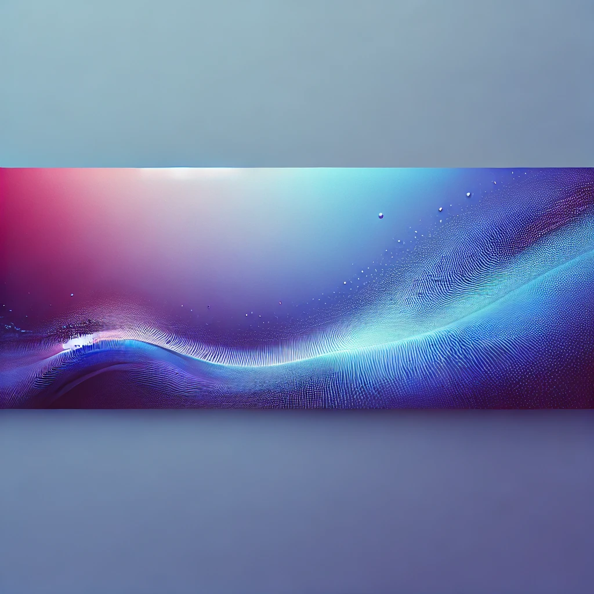

  <h1 class="content-heading-1">Recent Projects and Lessons Learned</h1>
  

    Over the past few months, I've been working on a variety of projects that have pushed my skills in web development and full-stack engineering. This post reflects on some of the most impactful projects, the challenges I faced, and the key lessons I learned through hands-on experience.
  

  
  <h2 class="content-heading-2">Project Highlights</h2>
  
  <h3 class="content-heading-3">WebGPU Shapes Renderer</h3>
  

    A demo of 2D shape rendering using WebGPU and Canvas, showcasing the power of modern web graphics APIs. This project required learning WebGPU from scratch and implementing an OBJ parser for 3D data.
  

  <ul class="content-list">
    <li class="content-list-item"><strong>Demo</strong>: <a href="https://bradleymatera.github.io/leaf-js/" class="content-link">bradleymatera.github.io/leaf-js</a></li>
    <li class="content-list-item"><strong>Repository</strong>: <a href="https://github.com/BradleyMatera/leaf-js" class="content-link">github.com/BradleyMatera/leaf-js</a></li>
    <li class="content-list-item"><strong>Lesson Learned</strong>: Diving into WebGPU taught me about low-level graphics programming on the web. I struggled with buffer management initially, but testing different data structures helped me optimize rendering performance.</li>
  </ul>
  
  <h3 class="content-heading-3">React Native Anime CRUD App</h3>
  

    A mobile CRUD application for anime data, integrating a Node.js backend with MongoDB. This was my first foray into mobile development with React Native.
  

  <ul class="content-list">
    <li class="content-list-item"><strong>Demo</strong>: <a href="https://cruddemo-one.vercel.app/" class="content-link">cruddemo-one.vercel.app</a></li>
    <li class="content-list-item"><strong>Lesson Learned</strong>: State management in mobile apps differs from web apps. I broke the UI with async data issues, but testing with React hooks like <code class="content-code">useEffect</code> helped me sync data properly.</li>
  </ul>
  
  <h3 class="content-heading-3">Docker Multilang Project</h3>
  

    A project focused on containerizing applications across multiple languages using Docker and Docker Compose, demonstrating portability and environment consistency.
  

  <ul class="content-list">
    <li class="content-list-item"><strong>Repository</strong>: <a href="https://github.com/BradleyMatera/docker_multilang_project" class="content-link">github.com/BradleyMatera/docker_multilang_project</a></li>
    <li class="content-list-item"><strong>Lesson Learned</strong>: Networking between containers was a hurdle. I tested various configurations, breaking setups intentionally to understand Docker networking, which led to a robust multi-container environment.</li>
  </ul>
  
  <h2 class="content-heading-2">Key Takeaways</h2>
  <ul class="content-list">
    <li class="content-list-item"><strong>Learning by Doing</strong>: Each project reinforced that I learn best by building, breaking, and fixing. Theoretical knowledge only clicks when I apply it practically.</li>
    <li class="content-list-item"><strong>Testing is Crucial</strong>: Intentionally pushing projects to their limits—whether overloading an API or testing large datasets—revealed weaknesses I could address before they became real issues.</li>
    <li class="content-list-item"><strong>Adaptability</strong>: Working across web, mobile, and container technologies showed me the importance of adapting to different environments and toolsets.</li>
  </ul>
  
  <h2 class="content-heading-2">What's Next</h2>
  

    I'm currently job hunting for roles in web development or full-stack engineering where I can apply these lessons. I'm also exploring more advanced topics like WebAssembly and machine learning integrations. If you have feedback or opportunities, connect with me on <a href="https://github.com/BradleyMatera" class="content-link">GitHub</a>.
  

  
  

